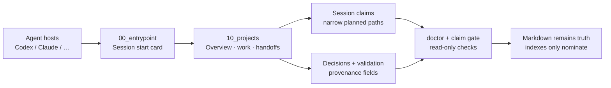

# Agent Brain Blueprint

[](https://github.com/MarkDonish/agent-brain-blueprint/actions/workflows/ci.yml)
[](LICENSE)
[](https://www.python.org/)

**Local-first, Markdown-native shared memory for multi-agent work.**

When Codex, Claude Code, and other agents share a machine, chat history is not a
team brain. This blueprint gives them a small, auditable vault for project
state, handoffs, decisions, validation, and narrow session claims — without
dumping secrets or raw conversations into Git.

> Not a personal memory dump. Not a hosted SaaS. A **template + scripts** you
> clone, bootstrap, and own.

## Why this exists

Multi-agent setups fail in boring, expensive ways:

| Pain | What usually happens | What this blueprint does |
| --- | --- | --- |
| Context amnesia | New session reloads half the world | Entry card → project overview → only the needed records |
| Overwrite chaos | Two agents edit the same notes | Narrow **session claims** + read-only claim gate |
| Fake memory | Vector hits treated as truth | **Markdown is canonical**; retrieval only nominates |
| Secret leakage | Logs and keys land in “shared memory” | Privacy scan + hard isolation boundaries |
| Unprovable done | “It works” with no evidence | Validation records before closeout |

Built for people who actually run **Codex / Claude / local agents** side by side.

## 60-second demo

```bash
git clone https://github.com/MarkDonish/agent-brain-blueprint.git
cd agent-brain-blueprint

# Inspect the fictional multi-agent story (no personal data)
python3 scripts/doctor.py examples/demo-vault
python3 scripts/check_session_claims.py examples/demo-vault
# free path → allowed; claimed current_work path → conflict (demo signal)
python3 scripts/check_claim_gate.py examples/demo-vault \
  --path 10_projects/demo-notes-app/60_summaries/INDEX.md

# Or bootstrap your own private vault
python3 scripts/bootstrap.py --destination ../my-agent-brain --project my-app
python3 scripts/doctor.py ../my-agent-brain
```

Walk the story: [examples/demo-vault](examples/demo-vault) · full guide: [docs/walkthrough.md](docs/walkthrough.md)

## How it fits together



## Quick start

```bash
git clone https://github.com/MarkDonish/agent-brain-blueprint.git
cd agent-brain-blueprint
python3 scripts/bootstrap.py --destination ../my-agent-brain --project example-app
python3 scripts/doctor.py ../my-agent-brain
python3 scripts/check_claim_gate.py ../my-agent-brain \
  --path 10_projects/example-app/10_current_work/INDEX.md
python3 scripts/check_privacy_scan.py .
```

Bootstrap creates a new local vault from the templates, copies record templates
into `60_templates/`, installs a vault `.gitignore`, and refuses non-empty
destinations.

## Design principles

1. **Markdown first.** Readable, diffable, portable.
2. **Retrieval is not truth.** Reopen the source Markdown or real runtime before acting.
3. **Project before chat.** Organize by state, handoff, validation, decision, sources.
4. **Minimal context.** Entry card, then only what the task needs.
5. **No silent writes.** Claims, closeout, and durable facts are explicit.
6. **Privacy by construction.** No credentials, raw chats, customer data, DBs, or logs in the vault.

## Session claims and closeout

Before changing shared memory, create a claim from `templates/session_claim.md`:

- `claimed_by` — which agent/host owns the claim
- `expires_at` — when the claim stops counting as active
- `planned_paths` — vault-relative paths only

```bash
python3 scripts/check_session_claims.py ./my-agent-brain
# Exclude your own claim (required after you create it)
python3 scripts/check_claim_gate.py ./my-agent-brain \
  --session-id YOUR-SESSION-ID \
  --path 10_projects/example-app/10_current_work/INDEX.md
# Or load session_id + planned_paths from the claim file
python3 scripts/check_claim_gate.py ./my-agent-brain \
  --claim 40_handoffs/session_claims/YOUR-CLAIM.md
```

Limits (honest ones):

- read-only, local-filesystem only
- `dry_run_*` is self-attested metadata
- **not** a distributed lock
- malformed existing claims fail closed (unless `--ignore-invalid-claims`)

Details: [docs/session-claims-and-closeout.md](docs/session-claims-and-closeout.md)

## Tooling

| Script | Purpose |
| --- | --- |
| `scripts/bootstrap.py` | Create a new local vault (`--project` supported) |
| `scripts/doctor.py` | Structure + governance + claims with repair hints |
| `scripts/check_vault_structure.py` | Skeleton existence |
| `scripts/check_memory_governance.py` | Strict decisions + soft validation/handoff/claims |
| `scripts/check_session_claims.py` | Claim shape, expiry, path conflicts |
| `scripts/check_claim_gate.py` | Pre-write conflict check (`--session-id` / `--claim` exclude self; fail-closed on bad claims) |
| `scripts/check_privacy_scan.py` | Pre-publish secret/path scan (secrets redacted in output) |
| `scripts/fix_vault_structure.py` | Optional dry-run / `--apply` skeleton repair |

Field contracts: `schemas/*.json` (zero third-party deps). Layout SSoT: `schemas/vault_layout.json`.

## Repository layout

```text
AGENTS.md                         shared operating rules for agent hosts
docs/                             architecture, privacy, walkthrough, claims
schemas/                          JSON field contracts
templates/vault/                  bootstrap source
templates/*.md                    record templates aligned to schemas
scripts/                          dependency-free validation tools
examples/demo-vault/              fictional multi-agent story (run doctor on it)
tests/                            regression tests
```

## Privacy boundary

Do not add credentials, private chats, customer data, databases, logs, or
absolute private paths to the public repository or generated vault examples.

```bash
python3 scripts/check_privacy_scan.py .
python3 scripts/check_privacy_scan.py . --strict
```

Optional allowlist: `.privacy-allowlist` · more: [docs/privacy.md](docs/privacy.md)

## Verification

```bash
make verify
```

CI runs the same unit tests, template doctor, privacy scan, and bootstrap smoke.

## Codex / multi-agent note

This repo is intentionally **Codex-friendly and host-agnostic**:

- plain Markdown + Python 3 stdlib (no vendor lock-in)
- claim + closeout workflow matches how coding agents already leave handoffs
- privacy scanner is meant for pre-publish of agent-produced docs

If you maintain OSS with local agents, star and open issues when the vault shape
does not match your workflow — that feedback is the adoption signal.

## Contributing

See [CONTRIBUTING.md](CONTRIBUTING.md). Small, test-backed PRs welcome:
docs clarity, demo improvements, schema edge cases, checker UX.

## License

MIT. See [LICENSE](LICENSE).
